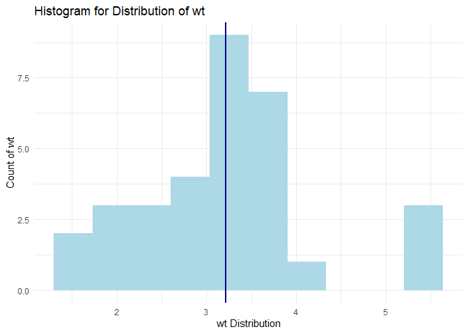
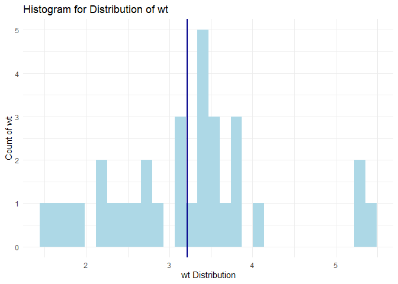

<!-- README.md is generated from README.Rmd. Please edit that file -->

# assignmentb2.graphHistograms

<!-- badges: start -->

<!-- badges: end -->

The goal of `assignmentb2.graphHistograms` is to provide users with an
efficient way of graphing histograms when doing data exploration, to
speed up the process of understanding what the data in a dataset looks
like. A common use is when you are wanting to understand what the
distribution and patterns are of a numerical variable in a dataset, what
trends are present, and whether this fits a question you have in mind.

The specific use of this package is to plot a histogram of a numerical
variable in the dataset of choosing, and label it’s mean value on the
plot as an x-intercept line. It also outputs what the mean is so that
this can be documented instead of relying on the graph alone. For
further customisation, the number of bins and decimal places for the
mean can be chosen based on what is best for the questions you are
trying to answer.

## Installation

You can install the development version of assignmentb2.graphHistograms
from [GitHub](https://github.com/) with:

``` r
# install.packages("devtools")
library(devtools)
devtools::install_github("stat545ubc-2025/assignmentb2.graphHistograms")
```

## Examples

These are two basic examples which show you how to solve a common
problem:

### Example 1

In this example, the ‘wt’ variable from the base R dataframe ‘mtcars’
will be graphed, with 10 bins, and the mean value will have 4 decimal
places.

``` r

library(assignmentb2.graphHistograms)
plot_distribution_and_mean(mtcars, wt, 10, 4)
#> $plot
```



    #> 
    #> $mean_var
    #> [1] "The mean of wt is 3.2172"

### Example 2

In this example the ‘mpg’ variable from the ‘mtcars’ dataset will be
graphed, with the default 30 bins, and the mean value will have a
default of 3 decimal places.

``` r
plot_distribution_and_mean(mtcars, mpg)
#> $plot
```



    #> 
    #> $mean_var
    #> [1] "The mean of mpg is 20.091"

## Dependencies

This package requires certain dependencies, which are loaded upon
download. For reference, the packages are listed below:

``` r
library(dplyr)
#> 
#> Attaching package: 'dplyr'
#> The following objects are masked from 'package:stats':
#> 
#>     filter, lag
#> The following objects are masked from 'package:base':
#> 
#>     intersect, setdiff, setequal, union
library(ggplot2)
library(magrittr)
library(assignmentb2.graphHistograms) # this package!
```
